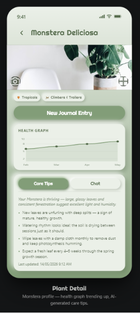
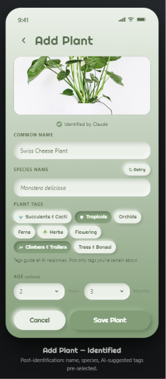
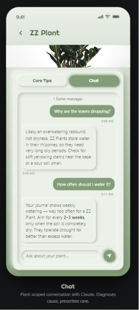
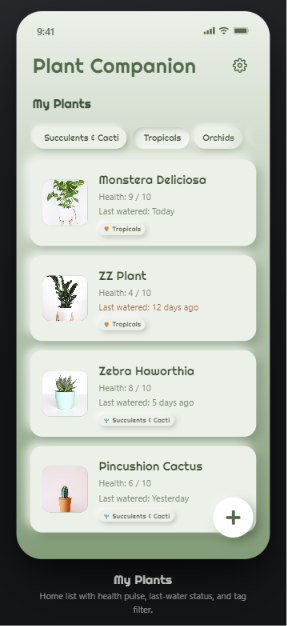

# Plant Companion

A mobile-first PWA for tracking and understanding your plants — powered by Claude AI.

**[Live Demo →](https://plant-companion.netlify.app)**

---

## Screenshots

<table>
  <tr>
    <td align="center"><br/><sub>Add Plant — AI identification</sub></td>
    <td align="center"><br/><sub>My Plants</sub></td>
  </tr>
  <tr>
    <td align="center"><br/><sub>Chat with your plant</sub></td>
    <td align="center"><br/><sub>Plant Detail — health graph &amp; care tips</sub></td>
  </tr>
</table>

---

## What it does

- **Identify plants by photo** — take a photo or upload from gallery, Claude vision identifies the species instantly
- **Retry identification** — if the AI guess is wrong, retry with the same photo (excludes the previous guess) or swap to a new photo entirely
- **Smart tag suggestions** — after identification, Claude suggests relevant plant-type tags; pick from 10 predefined categories to sharpen every AI response
- **Journal your care** — log watering, feeding, pruning, and repotting with optional photos and notes
- **AI health scoring** — every journal entry gets a health score (1–10) and personalised care insights
- **Health graph** — visualise your plant's health trend over time
- **Chat with your plant** — ask anything about care, problems, or pests; the AI has full visual context (profile photo + recent journal photos) and the complete journal history
- **Photo timeline** — chronological photo history of each plant
- **Works offline** — full PWA with service worker caching; install it to your home screen

---

## Stack

- Vanilla HTML / CSS / JS — no framework, no build step
- [Claude API](https://www.anthropic.com) — `claude-sonnet-4-5` for photo identification (vision), `claude-haiku-4-5` for journal analysis and chat
- Chart.js for health graphs
- localStorage for all data — no backend, no login
- Service worker for offline support and PWA install
- Google Analytics 4 for view-level usage tracking (each in-app screen is tracked as a named `page_view` event)

---

## Architecture

Three-layer separation kept deliberately clean for a future React Native port:

| Layer | File | Responsibility |
|---|---|---|
| Storage | `storage.js` | All localStorage reads/writes |
| AI | `ai.js` | All Claude API calls |
| UI | `ui.js` + `index.html` | Rendering and interactions |

Each layer has one job and never crosses into another. Swapping `storage.js` for AsyncStorage in V3 will require zero changes to `ai.js` or `ui.js`.

---

## Running locally

No build step needed — just open `index.html` in a browser or use a local server:

```bash
# Using VS Code Live Server, or:
npx serve .
```

On first launch you'll be prompted for your Anthropic API key. Get one free at [console.anthropic.com](https://console.anthropic.com). The key is stored only in your browser's localStorage and never sent anywhere except directly to Anthropic's API.

---

## Design

Neomorphic design system on a sage green gradient (`#eaf0e8 → #7a9e76`). All shadows use `rgba` values so depth reads correctly across both the light top and dark bottom of the gradient. Righteous font self-hosted as a TTF for reliable offline rendering.

---

## Roadmap

| Version | Status |
|---|---|
| V1 — Core PWA (identify, journal, health graph, care tips) | ✅ Live |
| V2 — Chat with visual context, photo timeline, tags, re-identification, GA analytics | ✅ Live |
| V3 — Native mobile app (React Native or Capacitor) | Planned |

---

## License

MIT
